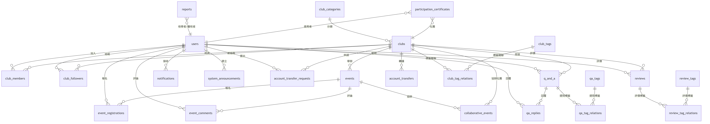
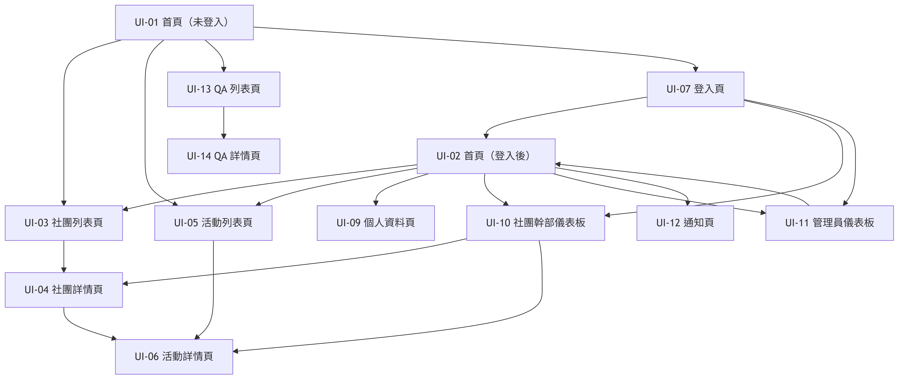

# 第三章 軟體設計規格

## 一、資料庫設計

本系統採用 MySQL 8.0+ 作為主要關聯式資料庫，不使用 Firestore 或其他 NoSQL 作為持久化儲存。

### （一）關連一覽表

依範本格式，以下列出資料表編號、資料表名稱（真實名稱）與說明。

| 資料表編號 | 資料表名稱（真實名稱） | 說明 |
|---|---|---|
| T01 | users | 使用者基本資料與角色權限 |
| T02 | club_categories | 社團分類主檔 |
| T03 | clubs | 社團主檔 |
| T04 | club_tags | 社團標籤主檔 |
| T05 | club_tag_relations | 社團與標籤關聯 |
| T06 | club_members | 社團成員與幹部權限 |
| T07 | club_followers | 使用者追蹤社團紀錄 |
| T08 | events | 活動主檔 |
| T09 | collaborative_events | 活動協辦社團關聯 |
| T10 | event_registrations | 活動報名紀錄 |
| T11 | event_attendance | 活動簽到紀錄 |
| T12 | event_comments | 活動評論 |
| T13 | campus_locations | 校園地點主檔 |
| T14 | qa_tags | Q&A 標籤主檔 |
| T15 | q_and_a | 提問主檔 |
| T16 | qa_tag_relations | 提問與標籤關聯 |
| T17 | qa_replies | 提問回覆 |
| T18 | qa_reply_helpful | 回覆有幫助/沒幫助投票 |
| T19 | reviews | 社團評價 |
| T20 | review_tags | 評價標籤主檔 |
| T21 | review_tag_relations | 評價與標籤關聯 |
| T22 | reports | 檢舉紀錄 |
| T23 | system_announcements | 系統公告 |
| T24 | notifications | 個人通知 |
| T25 | account_transfers | 帳號轉讓歷程 |
| T26 | account_transfer_requests | 帳號轉讓申請 |
| T27 | participation_certificates | 參與證明 |
| T28 | activity_logs | 系統活動日誌 |

### （二）關連結構

範本示意以 Product / Customer / SalesOrderMaster / SalesOrderDetail 說明主從關係；本系統對應之核心關係如下：

1. users 與 club_members、club_followers、event_registrations、reviews、notifications 為一對多。
2. clubs 與 events、club_members、club_followers、reviews 為一對多。
3. clubs 與 club_tags 透過 club_tag_relations 為多對多。
4. events 與 clubs 以 club_id 關聯，events 與 collaborative_events 形成一對多後再連到協辦社團。
5. q_and_a、qa_replies、qa_tags 透過 qa_tag_relations 形成問答與標籤關聯。

核心 ER 圖如下：

### （三）欄位與鍵值註解

- PK：Primary Key（主鍵）
- FK：Foreign Key（外鍵）
- AI：Auto Increment（自動遞增）
- NN：Not Null（不可為空）

### （四）補充說明

1. 資料庫命名採 snake_case。
2. 主鍵與外鍵欄位多採 *_id 命名。
3. 多對多關係以關聯表拆解，避免重複欄位。
4. 正式驗收以 database/schema.sql 與 migrations 實際結構為準。

## 二、介面設計

### （一）介面藍圖一覽表

| 介面編號 | 介面名稱 | 說明 |
|---|---|---|
| UI-01 | 首頁（未登入） | 訪客入口，提供社團/活動/QA 導覽 |
| UI-02 | 首頁（登入後） | 顯示個人資訊、追蹤動態與通知 |
| UI-03 | 社團列表頁 | 依分類、標籤、關鍵字搜尋社團 |
| UI-04 | 社團詳情頁 | 顯示社團資訊、追蹤與近期活動 |
| UI-05 | 活動列表頁 | 顯示活動清單與篩選條件 |
| UI-06 | 活動詳情頁 | 報名、取消報名、評論與時效資訊 |
| UI-07 | 登入頁 | 身分驗證與角色導向 |
| UI-08 | 註冊頁 | 建立新帳號 |
| UI-09 | 個人資料頁 | 個資維護、通知檢視、參與證明 |
| UI-10 | 社團幹部儀表板 | 社團管理、活動發布與名單匯出 |
| UI-11 | 管理員儀表板 | 公告、幹部、檢舉與帳號轉讓管理 |
| UI-12 | 通知頁 | 顯示追蹤社團與系統通知 |
| UI-13 | QA 列表頁 | 提問列表與搜尋 |
| UI-14 | QA 詳情頁 | 問答互動與回覆回饋 |

### （二）介面藍圖

1. 首頁分為未登入與登入後兩種狀態，登入後依角色顯示不同入口。
2. 社團與活動頁支援由列表進入詳情，並顯示更新時間以反映資訊時效。
3. 社團幹部儀表板提供社團資料編修與活動發布，結果同步回寫前台畫面。
4. 管理員儀表板提供公告與名單管理，對應全站通知與首頁公告區。

介面狀態圖如下：

## 三、資源需求（預算經費）

### （一）開發系統所需資源與經費預估（表1-1）

#### 1. 人力

| 角色 | 人數 | 工時（小時） | 時薪（NT$） | 預估費用（NT$） |
|---|---|---|---|---|
| 專案管理/需求分析 | 1 | 40 | 800 | 32,000 |
| 後端工程師 | 1 | 120 | 900 | 108,000 |
| 前端工程師 | 1 | 110 | 850 | 93,500 |
| 資料庫設計與維護 | 1 | 40 | 850 | 34,000 |
| 測試與驗收 | 1 | 50 | 700 | 35,000 |
| 文件整理 | 1 | 30 | 600 | 18,000 |
| 合計 | - | - | - | 320,500 |

#### 2. 軟體

- 作業系統：Windows 10/11
- 資料庫：MySQL 8.0+
- 開發環境：VS Code、Apache/AppServ、PHP 7.4+
- 程式語言：PHP、JavaScript、HTML、CSS
- 測試工具：Playwright、PowerShell、MySQL Client

#### 3. 硬體

- 網路：至少 20Mbps 以上穩定連線
- 伺服器：Web/API 與資料庫主機（可用等效雲端）
- 個人電腦：i5 等級以上、16GB RAM、256GB SSD 以上
- 手機：Android 與 iOS 測試裝置

### （二）營運系統前三年所需資源與經費預估（表1-2）

#### 1. 人力

| 角色 | 每月工時 | 時薪（NT$） | 年費用（NT$） | 三年費用（NT$） |
|---|---|---|---|---|
| 系統維運工程師 | 20 | 850 | 204,000 | 612,000 |
| 資料庫維護/備份 | 10 | 850 | 102,000 | 306,000 |
| 使用者支援/內容審核 | 15 | 600 | 108,000 | 324,000 |
| 功能小改版與修正 | 15 | 850 | 153,000 | 459,000 |
| 合計 | - | - | 567,000 | 1,701,000 |

#### 2. 軟體

- 作業系統：Linux 或 Windows Server
- 資料庫：MySQL 8.0+（含定期備份）
- 開發環境：維運工具、備份工具、監控工具
- 程式語言：PHP、JavaScript

#### 3. 硬體

- 網路：對外服務穩定頻寬與監控
- 伺服器：Web/API 主機 + 資料庫主機
- 個人電腦：維運與客服使用設備
- 手機：行動端功能驗證設備

#### 4. 雲端伺服器費用計算依據

- https://cloud.google.com/products/calculator?hl=zh-tw
- 依目前估算，前三年雲端與基礎設施費用約 NT$108,000 至 NT$120,000（實際依流量與規格調整）。

## 章節結語

本章已依範本第三章結構完成資料庫設計、介面設計與資源需求三大區塊，並對應本系統現行實作內容與圖檔。
